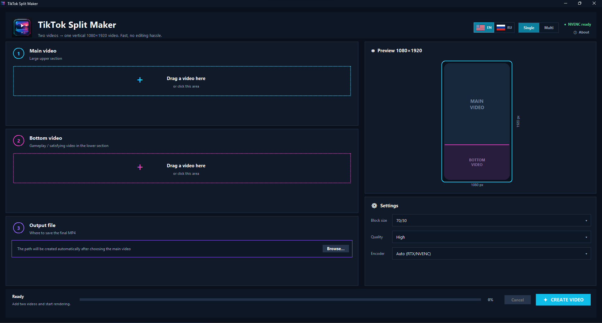
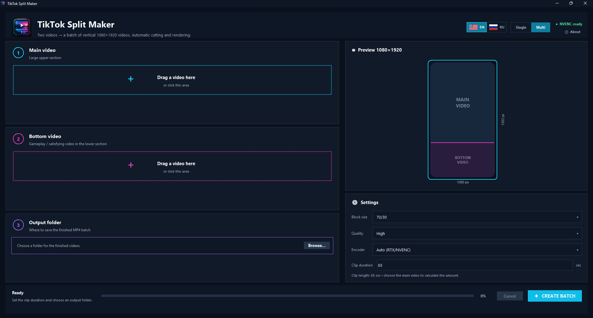
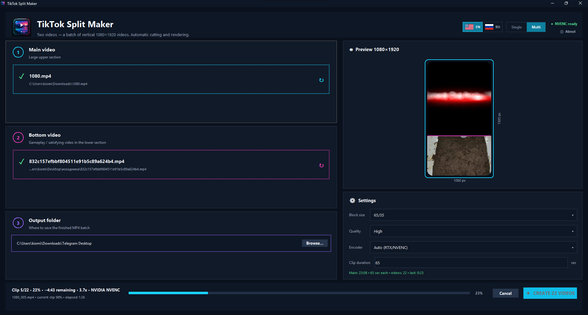

# TikTok Split Maker

A fast Windows desktop tool for combining a main video with a secondary gameplay / satisfying video into vertical **1080×1920** clips.

**Author:** [kiomi](https://github.com/kiomi1301)  
**In collaboration with:** ChatGPT, OpenAI  
**License:** GNU GPL v3.0

> English is the default interface language. Russian can be enabled instantly from the flag buttons in the top bar.

## Features

- Modern dark desktop UI
- English / Russian interface switch
- Drag & drop for source videos
- Live split-screen preview
- Single-video mode
- Multi-video batch mode
- 70/30, 65/35 and 60/40 layouts
- Automatic H.264 encoding through NVIDIA NVENC when available
- CPU x264 fallback
- High / Very high / Small file quality presets
- Continuous lower-video timeline in batch mode
- Seamless looping when the lower video reaches its end
- Batch progress, current clip progress, ETA and render speed
- Safe queue cancellation that keeps completed clips and removes the incomplete one
- Fully self-contained Windows release: Python and FFmpeg do **not** need to be installed by the end user

## Screenshots

### Single mode


### Multi mode


### Batch render in progress


## Download

Open the **Releases** page and download:

`TikTok Split Maker.exe`

Run it directly. No Python installation, FFmpeg installation, PATH changes or extra packages are required.

## Multi mode

Example: the main video is 25 minutes long and the clip length is 65 seconds.

The app automatically creates:

```text
source_001.mp4
source_002.mp4
source_003.mp4
...
```

The main video is cut sequentially with no gaps or repeated sections. The bottom video follows its own continuous timeline. If it reaches the end halfway through an output clip, the remaining part is taken from the beginning of the bottom video.

For example:

```text
bottom tail: 20 sec
+
bottom beginning: 45 sec
=
one 65 sec output clip
```

The final remainder of the main video is preserved as a shorter last clip.

## NVIDIA NVENC

If NVIDIA NVENC is available, the app uses `h264_nvenc`. Otherwise `Auto (RTX/NVENC)` falls back to CPU x264.

The NVENC capability check is performed once and reused for the batch queue.

## Building from source

Requirements for developers:

- Windows 10/11 x64
- Python 3.12 x64
- Internet connection for downloading the pinned FFmpeg build

Run:

```bat
build_release.bat
```

The script downloads and verifies the pinned FFmpeg build, installs Python build dependencies, runs tests, and creates:

```text
dist\TikTok Split Maker.exe
```

The application is built with PyInstaller `--onefile --noupx`. No obfuscation or custom packer is used.

## Antivirus / SmartScreen note

Unsigned one-file applications built with PyInstaller can occasionally trigger generic heuristic antivirus warnings. The project intentionally uses no obfuscator, no UPX compression and no hidden network behavior. Source code and the complete build workflow are public so release binaries can be reproduced and inspected.

A code-signing certificate would further improve Windows reputation, but is not required for the app to function.

## FFmpeg licensing

Release builds bundle FFmpeg. See [THIRD_PARTY_NOTICES.md](THIRD_PARTY_NOTICES.md) for the exact build, checksum, source commit and license information. The release workflow publishes the corresponding FFmpeg source archive alongside the executable.

## License

TikTok Split Maker is licensed under the **GNU General Public License v3.0**. See [LICENSE](LICENSE).
